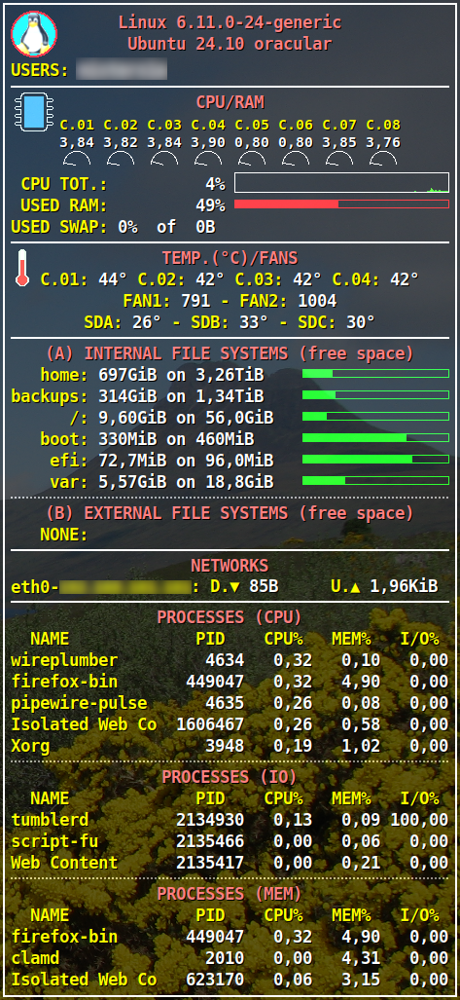

# **
conky.conf / conky.lua
**
### **
©Lurgainn 2025
**
  

## FEATURES
This is a higly configurable set of config files for **_'conky'_** program. It can only be used under Linux and it's tested under Xubuntu with conky version 1.22.1. This is an example of results: 

As you can see, this set doesn't aims to have a captivating graphics, but instead aims to always have under control what is important to know about your PC

## INSTALLATION
In the standard way, you can install everything by creating the **_'~/.config/conky'_** directory and copying there the **_'conky.conf'_** file and the directories **_'resources'_** and **_'lua'_** with all their files inside. 
But if you want to use a different directory, launching the **_'conky'_** program with the parameter **_'-c \<directory path\>'_**, you can do it by configuring some parameters within the **_'conky.conf'_** file as explained below.

## HOW TO CONFIGURE
At the start of the file **_'conky.conf'_** there are all the values that you can (and probably have to) modify to achieve your goal. 

**(1) FILES PATH** 
Under the section **'-- \*\*\*\*\* FILES PATH \*\*\*\*\*'** you will find all the values ​​that you can change to obtain the result of moving all this configuration from the standard position **_'~/.config/conky'_**. Keep in mind that the values ​​inserted in **RESOURCES_PATH** and **LUA_PATH** are always to be considered below **CONFIG_PATH**, while **LUA_FILE** will always be under **LUA_PATH**. 

**(2) WINDOW POSITION** 
Under the section **'-- \*\*\*\*\* WINDOW POSITION \*\*\*\*\*'** there is the value to be set to indicate where you want to make the **_'conky'_** window appear on the desktop. All usable values ​​are indicated in the comment. 

**(3) SWITCHES** 
With the **'-- \*\*\*\*\* SWITCHES \*\*\*\*\*'** section you have the opportunity to decide whether you want or not to display some sections of the **_'conky'_** window. The indications are quite self explanatory. Simply insert **'no'** on what you don't want to display. 
For example, if you have a CPU with a lot of cores and therefore the section concerning the details of each individual core becomes too large and all in all not very significant, simply set **SHOW_CPU_DETAILS = 'no'**. 

**(4) IMAGES** 
If you have decided to leave the images displayed, here you can indicate the exact location where they will be displayed and their dimensions, to fix them in the window you will get with your settings. 

**(5) COMMANDS CONSTANTS** 
Unless you have a distro deeply different from the standard (and therefore it doesn't have these commands), I think you will never need to change these values. 

**(6) HWMON (--- IMPORTANT !! ---)** 
Under Linux, to view the values ​​of temperatures and fans, it's necessary to use the parameters found under the directory **_'/sys/class/hwmon/'_**. The problem with this method is that the values ​​found there are highly dependent on your hardware and therefore also on the drivers used by your kernel. So you'll have to analyze what you have under that directory and consequently change some settings. 
In particular, you will have to find what contains the file **_'name'_** in the directory concerning your CPU, and identify the numbering of the various cores by analyzing the various **_'temp1_label'_**, 
**_'temp2_label'_** etc. With the results of this analysis you can change the two values of **CORES_TEMP_LOOK_FOR** and **CORE_TEMP_NAME**. 
The same will be made for the table **HARD_DISK_TEMP_LOOK_FOR**, looking for all the directories concerning your hard-disks. 

**(7) FILE SYSTEMS (--- IMPORTANT !! ---)** 
Into the table **FS_INTERNAL_ORDERED** you need to insert all the internal mount-points you have on your PC. They must be included in the order in which you want them displayed, and it isn't necessary to enter all their paths, but just insert the last directory of the mount-point.

## CONCLUSION 
I hope this set can be useful to someone. Feel free to adapt or modify this set to your needs.